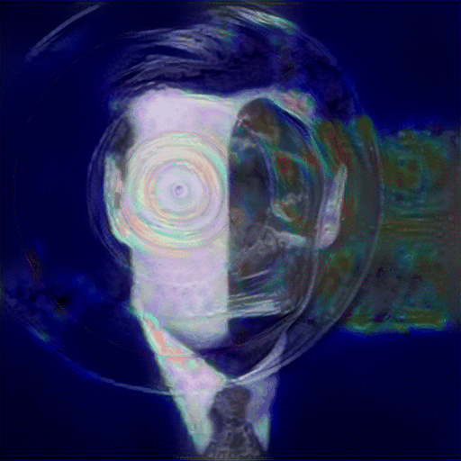

<h1 align="center">A brief introduction:</h1>
<h3 align="center">Research Engineer (Junior) in Artificial Intelligence, Data Analysis, Health Access</h3>

  

<strong><a href="https://vendenix.github.io/portfolio/" > My portfolio & curriculum vitae</a></strong>

 I will never stop learning and questioning myself, Never Settle.

 I am always willing to collaborate and participate in small projects!

 I'm tenacious and autonomous, I train myself using tutorials found on the internet.

 I love sharing the music I listen to, every month I upload a playlist of the songs I listen to on <a href="https://www.youtube.com/channel/UCvnR3rqm6nwvW2c0pp2ws1Q">my YouTube channel</a>. 

 I'm looking to contribute to Open-Source projects and am interested in AI and mobile/web applications.

<h2> My current level of study: Master's degree in Computer Science</h2>

<h3>A Historical Roadmap of Deep Learning Towards Artificial General Intelligence</h3>
 

  This roadmap charts the principal milestones in the development of deep learning, from the earliest formal models of artificial neurons to the open theoretical and architectural problems whose resolution is widely regarded as a prerequisite for Artificial General Intelligence (AGI). Items are classified into three categories: <strong>established</strong> (✅), denoting results that are well understood and have entered the canonical literature; <strong>active research</strong> (🟠), denoting programmes whose foundations exist but whose theoretical or empirical scope remains incomplete; and <strong>open problems</strong> (⬜), denoting questions for which no satisfactory framework has yet been proposed.

 
<h4>I. Foundations (1943–1986)</h4>
<ul>
  <li>✅ <strong>1943 — McCulloch–Pitts neuron.</strong> The first mathematical formalisation of an artificial neuron, establishing the computational primitive on which all subsequent neural architectures are built.</li>
  <li>✅ <strong>1957 — Rosenblatt's perceptron.</strong> The first supervised learning algorithm with a convergence guarantee for linearly separable data.</li>
  <li>✅ <strong>1969 — Minsky and Papert's critique.</strong> A formal demonstration of the perceptron's inability to represent non-linearly separable functions, precipitating the first AI winter.</li>
  <li>✅ <strong>1971–1982 — Vapnik–Chervonenkis theory.</strong> The introduction of VC dimension, providing the first rigorous framework for statistical learning theory and uniform convergence bounds.</li>
  <li>✅ <strong>1986 — Backpropagation.</strong> Rumelhart, Hinton, and Williams demonstrate that internal representations can be learnt by gradient descent through composed differentiable layers.</li>
</ul>
 
<h4>II. Convolutional Architectures and the Second Winter (1989–2006)</h4>
<ul>
  <li>✅ <strong>1989 — LeNet.</strong> LeCun's convolutional network for handwritten digit recognition, establishing weight sharing and translation equivariance as core principles.</li>
  <li>✅ <strong>1995 — Support vector machines and PAC-Bayes theory.</strong> McAllester's PAC-Bayesian bounds and the rise of kernel methods, which would dominate machine learning for the following decade.</li>
  <li>✅ <strong>1997 — Long short-term memory.</strong> Hochreiter and Schmidhuber's solution to the vanishing gradient problem in recurrent networks.</li>
  <li>✅ <strong>2000s — The second AI winter.</strong> Deep architectures are largely abandoned in favour of kernel methods and shallow probabilistic models.</li>
</ul>
 
<h4>III. The Deep Learning Renaissance (2006–2017)</h4>
<ul>
  <li>✅ <strong>2006 — Deep belief networks.</strong> Hinton's unsupervised layer-wise pre-training reignites interest in deep architectures.</li>
  <li>✅ <strong>2012 — AlexNet.</strong> Krizhevsky, Sutskever, and Hinton's decisive victory on ImageNet, marking the empirical breakthrough of GPU-accelerated deep learning.</li>
  <li>✅ <strong>2014 — Generative adversarial networks.</strong> Goodfellow et al. introduce a novel paradigm for generative modelling based on adversarial training.</li>
  <li>✅ <strong>2015 — Residual networks and batch normalisation.</strong> Architectural innovations that render networks of one hundred or more layers tractable to train.</li>
  <li>✅ <strong>2017 — Transformer architecture.</strong> Vaswani et al.'s "Attention is All You Need", which would subsequently underpin the entire generation of large language models.</li>
</ul>
 
<h4>IV. Large Language Models and Scaling Laws (2018–2023)</h4>
<ul>
  <li>✅ <strong>2018–2019 — BERT and GPT-2.</strong> The pre-train then fine-tune paradigm becomes the dominant methodology in natural language processing.</li>
  <li>✅ <strong>2020 — Scaling laws.</strong> Kaplan et al. and subsequently the Chinchilla work establish predictable power-law relationships between compute, data, parameters, and loss.</li>
  <li>✅ <strong>2020 — Intrinsic dimensionality of fine-tuning.</strong> Aghajanyan et al. demonstrate that BERT can be fine-tuned within a subspace of approximately two hundred dimensions, foreshadowing low-rank adaptation methods.</li>
  <li>✅ <strong>2021 — LoRA.</strong> Hu et al. provide an empirical validation of the low intrinsic dimensionality hypothesis through low-rank weight updates.</li>
  <li>✅ <strong>2022–2023 — ChatGPT, GPT-4, and reinforcement learning from human feedback.</strong> Large-scale emergence and the formalisation of preference-based alignment.</li>
</ul>
 
<h4>V. Theory of Generalisation (Active Research)</h4>
<ul>
  <li>🟠 <strong>2017– — Loss landscape geometry and flat minima.</strong> Investigations into mode connectivity (Garipov et al., Entezari et al.) and the relationship between curvature and generalisation.</li>
  <li>🟠 <strong>2017– — Non-vacuous PAC-Bayes bounds.</strong> Dziugaite and Roy's framework for numerically computable generalisation guarantees on deep networks, the first such bounds to yield non-trivial values.</li>
  <li>🟠 <strong>2019– — Double descent, neural tangent kernel, and implicit regularisation.</strong> Counter-intuitive generalisation phenomena that remain only partially understood.</li>
  <li>🟠 <strong>2020– — Geometric deep learning.</strong> Bronstein et al.'s unification of convolutional, graph, and attention-based architectures under a common framework of group equivariance, often described as the Erlangen Programme of deep learning.</li>
  <li>🟠 <strong>2022– — Mechanistic interpretability and sparse autoencoders.</strong> The systematic decomposition of learnt representations into monosemantic features, addressing the superposition hypothesis (Anthropic, Olah and collaborators).</li>
</ul>
 
<h4>VI. Open Problems on the Path to AGI</h4>
<ul>
  <li>⬜ <strong>Why stochastic gradient descent finds generalising minima.</strong> The central unresolved question of deep learning theory; no fully satisfactory account exists.</li>
  <li>⬜ <strong>A formal theory of the inductive bias stored in pre-trained weights.</strong> The characterisation of what θ₀ encodes remains essentially descriptive rather than predictive.</li>
  <li>⬜ <strong>An effective VC dimension for fine-tuning.</strong> A tight bound relating ‖Δθ‖, domain divergence, and target-task generalisation error has yet to be established.</li>
  <li>⬜ <strong>Computable and tight measures of domain divergence.</strong> The Ben-David ℋ-divergence bounds, whilst theoretically elegant, remain vacuous in practice.</li>
  <li>⬜ <strong>Functional equivalences between architectures.</strong> A rigorous formalism for transforming, for instance, a convolutional network into a graph neural network whilst preserving learnt information.</li>
  <li>⬜ <strong>Canonical unfolded representations of trained networks.</strong> A geometric form in which each direction is monosemantic and the effective dimension of learning is directly measurable.</li>
  <li>⬜ <strong>Multi-agent architectures inspired by Global Workspace Theory.</strong> Specialised modules communicating through a shared workspace, following the cognitive frameworks of Baars and Dehaene.</li>
  <li>⬜ <strong>Continual learning without catastrophic forgetting.</strong> The capacity to acquire new tasks without degrading performance on previously learnt ones.</li>
  <li>⬜ <strong>Causal reasoning and long-horizon planning.</strong> Capabilities extending beyond statistical pattern-matching towards genuine inference and goal-directed behaviour.</li>
  <li>⬜ <strong>Verifiable alignment and formal safety guarantees.</strong> Provable bounds on the behaviour of highly capable systems.</li>
  <li>⬜ <strong>Artificial General Intelligence.</strong> The conjectured culmination of the preceding programmes, contingent upon the resolution of the open problems above.</li>
</ul>
 
 I work on MacOS with Warp terminal

 
 I am also ready to work remotely.

<h3 align="left">Programming languages and technologies</h3>

 
   
   
   
  </a> 
   
  
   

  

I also know a lot of other things, I have networking skills, I can do video editing, use virtual machines, and so on...

<h2> Contact </h2>

  
  

