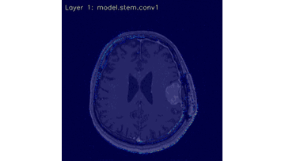
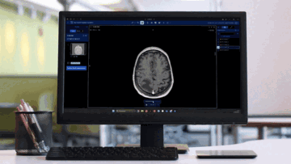


<h1 align="center">Romain Andres</h1>
<h3 align="center">AI Engineer — Explainable AI & Deep Learning for Oncology and Personalized Medicine</h3>

  <a href="https://vendenix.github.io/portfolio/"><strong>Portfolio & CV</strong></a> ·
  <a href="https://vendenix.github.io/portfolio/publications/">Publications</a> ·
  <a href="https://www.linkedin.com/in/romain-andres-6b551b203/">LinkedIn</a> ·
  <a href="mailto:contact.randres@gmail.com">Email</a>

I build deep learning systems for oncology that clinicians can actually trust — from segmentation models deployed in radiotherapy workflows to explainability pipelines that catch a model relying on the wrong signal before it reaches a clinic. Co-first author on a *NeuroImage* paper, first author on a manuscript currently under review. Currently looking for my next step: a **CIFRE PhD** or a **research/AI engineer role**.

## Featured work

<table>
<tr>
<td width="220"></td>
<td>

**Explainability & Clinical Trust of Deep Learning in Glioblastoma Treatment Response** — *first-author manuscript, under review*

A multi-layered XAI pipeline (Grad-CAM, LRP, LIME, linear probing, causal activation patching) auditing a ResNet-51q model — and catching it relying on a proxy for surgical resection status instead of real tumoral features.

[`Read the write-up →`](https://vendenix.github.io/portfolio/blog/2025/xai-glioblastoma-treatment-response/) · [`Code`](https://github.com/VendenIX/GBM-Treatment-Response-XAI)

</td>
</tr>
<tr>
<td width="220"></td>
<td>

**MetIA — Deep Learning Interface for Brain Metastases Segmentation** — *co-first author, published in [NeuroImage](https://doi.org/10.1016/j.neuroimage.2025.121002), Vol. 306 (2025)*

UNETR-based segmentation model deployed into a clinical OHIF Viewer interface at Centre François Baclesse, from Flask API to ML Ops on the center's infrastructure.

[`Read the write-up →`](https://vendenix.github.io/portfolio/blog/2024/metia-ohif-brain-segmentation/) · [`Code`](https://github.com/VendenIX/BrainMetaSegmentatorUI-Front)

</td>
</tr>
<tr>
<td width="220"></td>
<td>

**GeneticPedigreeChartToPed — Digitizing Family Trees for Hereditary Cancer Risk**

A six-model computer vision pipeline (YOLO, EasyOCR, DeepLSD, graph reconstruction) turning hand-drawn pedigree charts into structured data for tools like CanRisk.

[`Read the write-up →`](https://vendenix.github.io/portfolio/blog/2023/genetic-pedigree-chart-to-ped/) · [`Code`](https://github.com/VendenIX/GeneticPedigreeChartToPedAI)

</td>
</tr>
</table>

<strong> Earlier projects</strong> (coursework & side projects)

 

| Project | Description |
|---|---|
| [Sorting Algorithms Visualizer](https://vendenix.github.io/portfolio/blog/2023/sorting-algorithms-visualizer/) | C++ visualizer + Python/Jupyter benchmarking of sorting algorithms across data distributions. |
| [AI vs. AI — Virus Board Game](https://vendenix.github.io/portfolio/blog/2022/virus-board-game-ai/) | Minimax/Alpha-Beta Pruning agents battling on a custom board game. |
| [Todolist — React Native](https://vendenix.github.io/portfolio/blog/2022/todolist-react-native/) | First React project: a to-do app on a Node.js/GraphQL CRUD API. |
| [Fractal Flowers Generator](https://vendenix.github.io/portfolio/blog/2021/fractal-flowers-lsystem/) | Procedural flora generation from scratch using L-systems (Java). |

## Publications
Most of this work was carried out at Centre François Baclesse (Caen) under the supervision of Dr. Aurélien Corroyer-Dulmont (PhD, HDR).

| Title | Venue | My contribution |
|---|---|---|
| [Development and routine implementation of a deep learning algorithm for automatic brain metastases segmentation on MRI for RANO-BM criteria follow-up](https://doi.org/10.1016/j.neuroimage.2025.121002) | NeuroImage, Vol. 306 (2025) | **Co-first author** Optimized model inference, built the clinical integration (OHIF Viewer, Flask API, deployment), and contributed to method design, data curation, results analysis, and manuscript writing and review. |
| Explainability and Clinical Trust of Deep Learning in Glioblastoma Treatment Efficacy Prediction | Manuscript under review (2025) | **First author** Led the study end to end: designed and implemented the XAI pipeline, performed image segmentation with computer vision methods, ran the analysis, produced the figures, and drafted and revised the manuscript. |

Full abstracts and BibTeX on the [publications page](https://vendenix.github.io/portfolio/publications/).

## Tech stack

- **Deep learning & XAI:** PyTorch · Grad-CAM/LRP/LIME · UNet/UNETR/ResNet · Fed-BioMed
- **Medical imaging:** DICOM · NIfTI · OHIF Viewer
- **Data & backend:** Python (NumPy/SciPy/pandas) · Flask · GraphQL · PostgreSQL · MongoDB
- **Tools:** Docker · Kubernetes · Git · Linux

  
  
  
  
  
  
  
  
  
  
  

## Contact

  contact.randres@gmail.com

  

